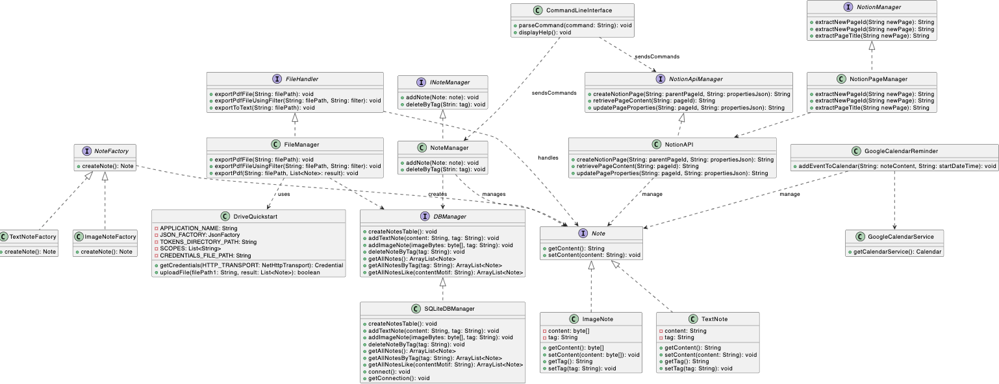

= ```SuperNote``` Documentation

SuperNote est un projet de gestion de notes, conçu pour offrir une expérience utilisateur fluide et efficace dans l'organisation et la gestion de notes.

== Nom du Projet : ```SuperNote```

== Description : 

SuperNote est une application de gestion de notes, offrant une gamme étendue de fonctionnalités pour répondre aux besoins de tous les utilisateurs, des particuliers aux professionnels. Cette application permet de créer, organiser, filtrer, exporter et synchroniser les notes sur différents supports, offrant ainsi une flexibilité maximale dans la gestion des informations.

== Fonctionnalités Principales :

- **Création et Gestion des Notes :** Permet de créer des notes textuelles et des notes contenant des images, de les organiser avec des tags, et de les enregistrer dans une base de données SQLite pour une gestion efficace.

- **Exportation des Notes :**  Offre la possibilité d'exporter les notes dans différents formats, notamment PDF et texte brut, pour une utilisation et une compatibilité maximales avec d'autres applications et systèmes.

- **Intégration avec Notion :**  Intègre l'API de Notion pour créer, mettre à jour et exporter des notes directement depuis l'application vers Notion, offrant ainsi une synchronisation transparente entre les deux plateformes.

- **Synchronisation avec Google Drive :**  Utilise l'API Google Drive pour synchroniser les notes avec un compte Google Drive, permettant ainsi un accès et une sauvegarde faciles des notes dans le cloud.

- **Intégration avec Google Calendar :**  Intègre l'API Google Calendar pour ajouter des rappels aux notes, offrant ainsi une fonctionnalité de gestion du temps avancée.

- **Extension pour Visual Studio Code :**  Fournit une extension pour Visual Studio Code, permettant aux utilisateurs de gérer leurs notes directement depuis le terminal de l'éditeur, améliorant ainsi l'efficacité pendant les sessions de programmation.

- **Fonctionnalité de Lien entre les Notes :** Permet de lier des notes entre elles en utilisant des identifiants, des tags et des noms spécifiques pour faciliter l'organisation et la navigation entre les notes liées.

- **Affichage des Notes dans le Terminal :**  Permet d'afficher rapidement le contenu des notes, leurs tags associés et les horaires de création directement dans le terminal, offrant ainsi une visualisation rapide et pratique des informations.

== Objectif : 

L'objectif principal de SuperNote est d'offrir une solution complète et polyvalente pour la gestion de notes, en intégrant les fonctionnalités avancées de synchronisation, d'exportation et d'intégration avec d'autres plateformes populaires telles que Notion et Google Drive. En offrant une expérience utilisateur fluide et une flexibilité maximale.

== Choix du Concept

Le développement de SuperNote en tant qu'application desktop de gestion de notes orientée ligne de commande découle de diverses considérations. Malgré la prolifération d'applications de prise de notes sur le marché, nombre d'entre elles privilégient une interface graphique utilisateur (GUI), offrant une expérience intuitive mais parfois moins efficace pour ceux qui souhaitent prendre des notes rapidement ou qui préfèrent une approche plus directe dans leur flux de travail.

En optant pour la ligne de commande comme interface principale, SuperNote vise à répondre aux besoins des utilisateurs familiers avec cette méthode d'interaction. Cela facilite également son intégration avec une gamme d'environnements, notamment les outils de développement où la ligne de commande reste un élément central pour de nombreux utilisateurs. De plus, en adoptant une approche polyvalente, SuperNote aspire à fournir une solution unifiée pour la gestion de notes, capable de s'intégrer harmonieusement avec différentes plateformes de prise de notes existantes et une variété d'outils de productivité.

== Analyse de la Concurrence

Le marché des applications de gestion de notes est déjà bien fourni, avec des solutions établies telles qu'Evernote, OneNote, Notion, et bien d'autres. Ces applications offrent une gamme de fonctionnalités allant de la prise de notes à la gestion des tâches, en passant par l'intégration multiplateforme et la collaboration. Certaines mettent l'accent sur des caractéristiques spécifiques telles que l'intégration avec d'autres outils de productivité, le support des médias riches, ou encore la facilité d'utilisation pour les équipes.

Cependant, SuperNote se distingue par son approche centrée sur la ligne de commande, offrant une interface rapide et directe pour la gestion des notes, particulièrement adaptée aux utilisateurs habitués à cette méthode d'interaction. Sa souplesse d'intégration avec diverses plateformes de prise de notes existantes, ainsi qu'avec des environnements de développement, vise à offrir une expérience de prise de notes unifiée et fluide pour les utilisateurs soucieux de leur productivité.

=== Installation de SuperNote

== Prérequis

Avant d'utiliser SuperNote, assurez-vous que votre système remplit les conditions suivantes :

- **Java :** SuperNote nécessite une installation de Java (version 21) sur votre système. Assurez-vous que Java est correctement installé et configuré.
[source, shell]
----
java -version
----

- **Gradle :** SuperNote nécessite une installation de Gradle (version 8.4) sur votre système. Assurez-vous que Gradle est correctement installé et configuré.
[source, shell]
----
gradle -version
----

- **Environnement de Ligne de Commande :** Étant une application basée sur la ligne de commande, SuperNote nécessite un environnement de ligne de commande fonctionnel sur votre système.

- **Git (optionnel) :** Pour cloner le dépôt Git de SuperNote et obtenir la dernière version du code source, vous pouvez installer Git si vous souhaitez accéder au code directement depuis le dépôt GitHub.

Assurez-vous de remplir ces conditions préalables avant de continuer avec l'installation et l'utilisation de SuperNote.

== Lancement de l'Application

Pour lancer SuperNote, suivez ces étapes :

1. **Cloner le Projet :** Clonez le répertoire du projet SuperNote sur votre machine locale en utilisant la commande suivante :
[source, shell]
----
git clone https://github.com/dounyaa/SuperNotes.git
----

2. **Accéder au Répertoire :** Naviguez vers le répertoire du projet SuperNote.
[source, shell]
----
cd SuperNote
----

3. **Compiler le Code :** Compilez le code source de SuperNote en utilisant Gradle.
- Sous (macOS/Linux)
[source, shell]
----
./gradlew build
----

- Sous Windows
[source, shell]
----
gradlew.bat build
----

3. **Exécuter l'Application :** Lancez l'application SuperNote.
- Sous (macOS/Linux)
[source, shell]
----
./gradlew run
----

- Sous Windows
[source, shell]
----
gradlew.bat run
----

== Utilisation
Pour utiliser SuperNote, voici les commandes que vous pouvez exécuter une fois l'application lancée depuis votre terminal :

- **Ajouter une note de type texte:** Pour ajouter une nouvelle note, utilisez la commande suivante :
[source, shell]
----
  sn add "Contenu de la note" --tag "tag"
----

- **Ajouter une note de type Image:** Pour ajouter une nouvelle note de type image (jpg, png, gif) , utilisez la commande suivante :
[source, shell]
----
  sn add "chemin/vers/image.png" --tag "tag"
----

- **Supprimer une note par ID:** Pour supprimerune note par son ID , utilisez la commande suivante :
[source, shell]
----
  sn delete "ID"
----

- **Supprimer les notes par tag:** Pour supprimer toutes les notes associées à un tag spécifique , utilisez la commande suivante :
[source, shell]
----
  sn delete --tag "mon_tag_a_supprimer"
----

- **Exporter les Notes en pdf:** Pour exporter vos notes dans un fichier de format pdf, utilisez la commande :
[source, shell]
----
  sn export --all "chemin/vers/fichier.pdf"
----

- **Exporter les Notes en texte brut:** Pour exporter vos notes dans un fichier de format txt, utilisez la commande :
[source, shell]
----
  sn export --text "chemin/vers/fichier.txt"
----

- **Exporter les Notes filtrer par Mot dans le Contenu:** Pour exporter vos notes contenant un mot spécifique dans un fichier de format pdf , utilisez la commande :
[source, shell]
----
  sn export --word "mot_a_chercher" "chemin/vers/fichier.pdf"
----

- **Créer une Note sur Notion:** Ajoute la fonctionnalité de création de notes directement sur Notion en utilisant la commande suivante.
[source, shell]
----
  sn notion create "Contenu de la note"
----

- **Mettre à jour le Contenu d'une Note sur Notion :** Permet de mettre à jour le contenu d'une note existante sur Notion en utilisant le contenu actuel de la note et le nouveau contenu spécifié :
[source, shell]
----
  sn notion update "Ancien contenu de la note" --note "Nouveau contenu de la note"
----

- **Enregister le Contenu d'une Page Notion dans Supernotes :** Permet de récupérer le contenu d'une page Notion spécifique :
[source, shell]
----
  sn notion get --page "ID_de_la_page_Notion"
----

- **Exporter les notes créer sur notion :** Permet de créer un fichier avec toutes les notes créer sur notion avec supernotes
[source, shell]
----
  sn export --tag "notion" "chemin/vers/fichier.pdf"
----

- **Synchroniser les notes avec Google Drive :** Permet de synchroniser les notes avec Google Drive. Toutes les fichiers exportés seront automatiquement disponibles dans son espace Google Drive.
[source, shell]
----
    sn export --tag "mon_tag" "chemin/vers/fichier.pdf"
----

- **Ajouter une note avec rappel :** Ajoutez des rappels pour des notes spécifiques avec une date et une heure précises.
[source, shell]
----
  sn add "Contenu de la note" --tag "tag" --reminder "YYYY-MM-DD HH:mm"
----

- **Suppression des rappels pour une note par tag :** Supprimez tous les rappels associés à une note spécifique par son tag.
[source, shell]
----
  sn delete --reminder --tag "tag"
----

- **Afficher des rappels pour une note par tag :** Afficher tous les rappels associés à une note spécifique par son tag.
[source, shell]
----
  sn get --reminder --tag "tag"
----

- **Lier des notes :** permet de lier une note existante à un ou plusieurs tags spécifiques, tout en lui attribuant un nom distinct pour une référence facile. Cette fonctionnalité est utile pour organiser et catégoriser vos notes de manière significative.
[source, shell]
----
  sn link --id "ID_de_la_note" --tag "tag1" [and/or] "tag2" [...] --name "Nom_de_lien" [--at/--before/--after "Date"]
----

- **Afficher les Liens :** permet d'afficher les liens précédemment établis entre des notes et des tags, en utilisant le nom de lien spécifié lors de la création.
[source, shell]
----
  sn show --link "Nom_de_lien"
----

- **Afficher les notes :**
[source, shell]
----
  sn show notes
----

- **Afficher l'Aide :** 
[source, shell]
----
  sn --help
----

- **Fermer l'Application :**
[source, shell]
----
    exit
----


Pour plus d'informations sur l'utilisation de SuperNotes, regardez le README. Vous pouvez également consulter [ce lien](https://github.com/dounyaa/SuperNotes) pour accéder directement au README.

== Diagramme de classe 


